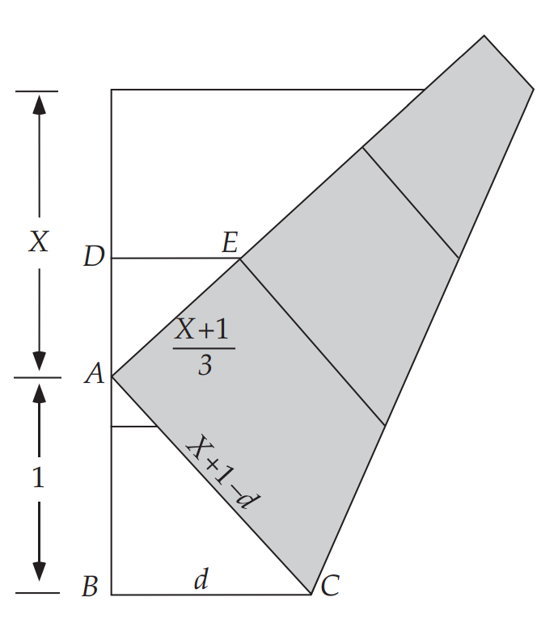

# 用折纸三等分任意锐角和倍立方

## 三等分任意锐角

三等分角是古希腊平面几何里尺规作图领域中的著名问题，与化圆为方及倍立方问题并列为尺规作图三大难题。尺规作图是古希腊人的数学研究课题之一，是对具体的直尺和圆规画图可能性的抽象化，研究是否能用规定的作图法在有限步内达到给定的目标。三等分角问题的内容是：==能否仅用尺规作图法将任意角度三等分？==

### 折纸解法

在正方形中，有一个锐角$\theta$，我们要将其三等分。首先在正方形下部任意对折，得到折痕$L_1$，此时应用折纸公理6(双点到线)，将$p_1$折到$L_1$上，同时将$p_2$折到角的另一边$L_2$上，此时$L_1$的延长线$L_3$即把$\theta$三等分

# **<u>折叠即对称</u>**

首先说明为什么$p_1$在$L_3$上

由折叠的对称性，原来的$p_1$成为了$C$，可知$xC=xp_1$，所以对顶角相等，即可推出$p_1$在$L_3$上

由图$AB=BC=CD$，由角平分线定理和$p_1B\perp AC$得$\triangle p_1AB\cong \triangle p_1BC\cong \triangle p_1CD$所以有三等分

## 倍立方

### 问题描述

==能否用尺规作图的方法作出一立方体的棱长，使该立方体的体积等于一给定立方体的两倍？==

### 相关传说

传说中，这问题的来源，可追溯到公元前429年。一场瘟疫袭击了希腊提洛岛（Delos），造成四分之一的人口死亡。岛民们去神庙请示阿波罗的旨意，神谕说：要想遏止瘟疫，得将阿波罗神殿中那正立方的祭坛加大一倍。人们便把每边增长一倍，结果体积当然就变成了8倍，瘟疫依旧蔓延；接着人们又试著把体积改成原来的2倍，但形状却变为一个长方体……第罗斯岛人在万般无奈的情况下，只好鼓足勇气到雅典去求救于当时著名的学者柏拉图。
开始，柏拉图和他的学生认为这个问题很容易。他们根据平时的经验，觉得利用尺规作图可以轻而易举地作一个正方形，使它的面积等于已知正方形的2倍，那么作一个正方体，使它的体积等于已知正方体体积的2倍，还会难吗?

### 折纸解法

首先将正方形三等分

将$p_1$折到$L_1$上，同时将$p_2$折到$L_2$上，则$p_1$折叠后的点将$L_1$分成两段，其长度之比$\frac X Y$即为$\sqrt[3]{2} $

为了简化计算，我们令$Y=1$，则正方形的边长即为$X+1$，由$\triangle ABC\sim\triangle EDA$有

$\frac { d } { X + 1 - d } = \frac { 2 X - 1 } { X + 1 } \Rightarrow \frac { X ^ { 2 } + 2 X } { X ^ { 2 } + 2 X + 2 } = \frac { 2 X - 1 } { X + 1 }$

$\Rightarrow X ^ { 3 } + 3 X ^ { 2 } + 2 X = 2 X ^ { 3 } + 3 X ^ { 2 } + 2 X - 2 \Rightarrow X ^ { 3 } = 2$

所以$X=\sqrt[3]{2} $

