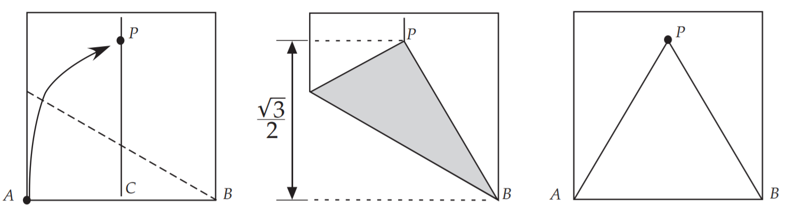
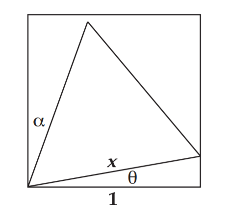
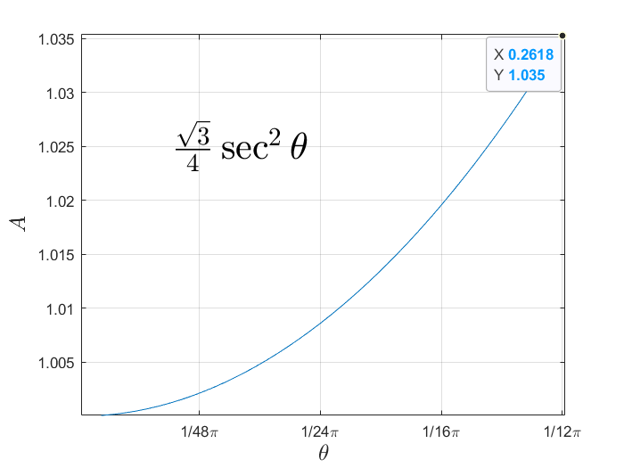

# 1.在正方形中折出等边三角形

要折等边三角形，首先要折出$60{\circ}$的角，以下是最容易的一种方法

如何让三角形最大呢

- 如果等边三角形的三个顶点没有落在正方形的四条边上，那么可以放大三角形让它落在边上
- 如果有顶点落在边上，可以平移该三角形，使其某一顶点落在正方形的任意顶点上

所以我们只需要研究某一个顶点和正方形的顶点重合的等边三角形

画出图形，由几何关系，三角形的边长$l$可以用$\theta$表达
$$
l=1 / \cos \theta=\sec \theta
$$
故面积$A$为
$$
A(\theta)=\frac{\sqrt{3}}{4} \sec ^{2} \theta
$$
根据对称性，我们只需要考虑$0^{\circ} \leq \theta \leq 15^{\circ}$的情况

可以暴力画图像（$\sec\theta$在$0^{\circ} \leq \theta \leq 15^{\circ}$单调递增）

或对面积求导
$$
\frac{\mathrm{d} A}{\mathrm{d} \theta } =2\cdot \frac{\sqrt{3}}{4} \cdot \frac{1}{\cos\theta  } \cdot -\frac{1}{\cos ^{2} \theta}\cdot
-\sin \theta  =\frac{\sqrt[]{3}\sin \theta  }{2\cos^{3} \theta }
$$
当$\theta=0^{\circ}$或$\theta=15^{\circ}$时有极值

由$\ddot{A}<0$或更简单的
$$
A(0)<A(15)
$$
故$A_{max}=\sqrt{6}-\sqrt{2}=1.035$

